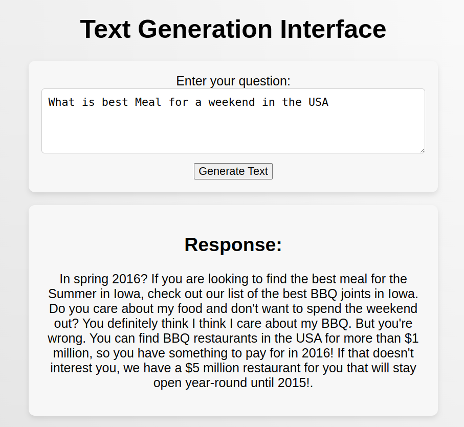

# Local LLM MODEL DEPLOYMENT

## Overview
This repository showcases a powerful text generation model integrated into a FastAPI microservice. The model, based on OpenAI's GPT-2 architecture, excels in generating coherent and context-aware responses. The FastAPI microservice provides a convenient API for interacting with the model in real-time.

## Key Features
Text Generation Model:

GPT-2-based model for natural language generation.
Trained on diverse datasets for versatile responses.

FastAPI Microservice:

Utilizes FastAPI for efficient and fast API development.User-friendly endpoint for generating responses by providing prompts.

## Project UI 

## Challenge with Finetuned model
Deploying the finetuned model posed challenges due to its size, prompting us to explore quantization techniques in the future. This ongoing exploration aims to optimize the model for deployment without compromising its performance, ensuring efficient usage in various applications.
